```{r initialize, echo = FALSE}
knitr::opts_chunk$set(
  collapse = TRUE, 
  comment = "#>", 
  cache.path = "cache/",
  fig.path = "man/figures/"
)
library(rerddap)
data("colors")
```


## Introduction

`rerddap` is a general purpose <span style="color:red">R</span> client for working with <span style="color:red">ERDDAP™</span> servers.  <span style="color:red">ERDDAP™</span> is a web service developed by Bob Simons of NOAA.  At the time of this writing, there are over sixty <span style="color:red">ERDDAP™</span> servers  (though not all are public facing) providing access to literally petabytes of data and model output relevant to oceanography, meteorology, fisheries and marine mammals, among other areas. <span style="color:red">ERDDAP™</span> is a simple to use, RESTful web service, that allows data to be subsetted and returned in a variety of formats.

This vignette goes over some of the nuts and bolts of using the `rerddap` package, and shows the power of the combination of the `rerddap` package with <span style="color:red">ERDDAP™</span> servers.  Some of the examples are taken from the `xtractomatic` package (available from CRAN - https://cran.r-project.org/package=xtractomatic), and some from the `rerddapXtracto` package available on Github (https://github.com/rmendels/rerddapXtracto),  but reworked to use `rerddap` directly.   Other examples are new to this vignette, and include both gridded and non-gridded datasets from several <span style="color:red">ERDDAP™s</span>.

Some new features in `rerddap` (as of version 1.2.0) are support for downloading `tabledap()` requests as parquet files,  which can greatly reduce the size of the download (this will only work for <span style="color:red">ERDDAP™</span> server greater or equal to version 2.25),  inclusion of units as attributes in the dataframe created by `tabledap()`, and all variables in a dataframe created by `tabledap()` now have the datatype defined in the <span style="color:red">ERDDAP™</span> server,  that is for example latitude and longitude will always be numbers,  not character strings as in the past.

The option to download files as parquet files means the `tabledap()` function definition is slightly changed,  it is now:

```{r, eval = FALSE, echo = TRUE}
tabledap <- function(x, ..., fields=NULL, distinct=FALSE, orderby=NULL,
  orderbymax=NULL, orderbymin=NULL, orderbyminmax=NULL, units=NULL, fmt = 'csv',
  url = eurl(), store = disk(), callopts=list())
```

Since the "fmt" argument is optional and defaults to "csv", which was used in previous versions of `tabledap()`,  this change will not affect existing scripts.  In order to downlaod as a parquet file,  just set "fmt = 'parquet'.  See below for an example.

The option to download a `tabledap()`

## Installation

The first step is to install the `rerddap` package, the stable version is available from CRAN:


```{r, eval = FALSE}
install.packages("rerddap")
```

or the development version can be installed from GitHub:

```{r, eval = FALSE}
remotes::install_github("ropensci/rerddap")
```

and to load the library:

```{r}
library("rerddap")
```

Besides `rerddap` the following libraries are used in this vignette:


```{r, eval = FALSE, echo = TRUE}
library("akima")
library("dplyr")
library("ggplot2")
library("mapdata")
library("ncdf4")
library("plot3D")
```

Code chunks are always given with the required libraries so that the chunks are more standalone in nature. Many of the plots use an early version of the `cmocean` colormaps designed by Kristen Thyng (see https://matplotlib.org/cmocean/ and https://github.com/matplotlib/cmocean) translatd from the original Python implementation. However, there is now a `cmocean` package for <span style="color:red">R</span>.  As past scripts may use the built-in color palette it is maintained here,  but use of the `cmocean` package is advisable as it is kept up-to-date.  In the present version of the `cmocean` package the names have changed, what is "temperature" here is now "thermal", "chlorophyll" is now "algae", and "salinity" is now "haline".

## The main `rerddap` functions

The complete list of rerddap functions can be seen by looking at he `rerddap` package help:

```{r, eval = FALSE}
?rerddap
```

and selecting the index of the package.  The main functions used here are:

* the list of servers `rerddap` knows about - `server()`
* search an <span style="color:red">ERDDAP™</span> server for terms - `ed_search(query, page = NULL, page_size = NULL, which = "griddap", url = eurl(), ...)`
* search a list of  <span style="color:red">ERDDAP™</span> servers for terms - `global_search(query, server_list, which_service)`
* get a list of datasets on an <span style="color:red">ERDDAP™</span> server - `ed_datasets(which = "tabledap", url = eurl())`
* obtain information about a dataset - `info(datasetid, url = eurl(), ...)`
* extract data from a griddap dataset - `griddap(x, ..., fields = "all", stride = 1, fmt = "nc", url = eurl(), store = disk(), read = TRUE, callopts = list())`
* extract data from a tabledap dataset - `tabledap(x, ..., fields = NULL, distinct = FALSE, orderby = NULL, orderbymax = NULL, orderbymin = NULL, orderbyminmax = NULL, units = NULL, url = eurl(), store = disk(), callopts = list())`

Be careful when using the functions `ed_search()`, `ed_datasets()` and `global_search()`.  The default <span style="color:red">ERDDAP™</span> has over 9,000 datasets,  most of which are grids, so that a list of all the gridded datasets can be quite long.  A seemly reasonable search:

```{r, eval = FALSE}
whichSST <- ed_search(query = "SST")
```

returns about 1000 responses.  The more focused query:

```{r, eval = FALSE}
whichSST <- ed_search(query = "SST MODIS")
```

still returns 172 responses.  If the simple search doesn't narrow things enough,  look at the advanced search function `ed_search_adv()`.

## Finding the Data You Want

The first way to find a dataset is to browse the builtin web page for a particular <span style="color:red">ERDDAP™</span> server.
A list of some of the public available <span style="color:red">ERDDAP™</span> servers can be obtained from the `rerddap` command:

```{r}
servers()
```

The list of <span style="color:red">ERDDAP™</span> servers is based on the list maintained at the *Awesome ERDDAP™* site compiled by the  Irish Marine Institute.

The second way to find and obtain the desired data is to use functions in `rerddap`.  The basic steps are:

1. Find the dataset on an <span style="color:red">ERDDAP™</span> server (`rerddap::servers()`, `rerddap::ed_search()`, `rerddap::ed_datasets()` ).
2. Get the needed information about the dataset (`rerddap::info()` )
3. Think about what you are going to do.
4. Make the request for the data  (`rerddap::griddap()` or `rerddap::tabledap()` ).

We discuss each of these steps in more detail, and then look at some realistic uses of the package.


### Think about what you are going to do.

This may seem to be a strange step in the process, but it is important because many of the datasets are high-resolution, and data requests can get very large, very quickly.  As an example, based on a real use case.  The MUR SST (	Multi-scale Ultra-high Resolution (MUR) SST Analysis fv04.1, see https://coastwatch.pfeg.noaa.gov/erddap/griddap/jplMURSST41.html )  is a daily, high-quality, high-resolution sea surface temperature product.  The user wanted the MUR data for a 2x2-degree box, daily for a year.  That seems innocuous enough.  Except that MURsst is at a one-hundreth of degree resolution.  If we assume just a binary representation of the data, assuming 8-bytes per value, and do the math:

```{r}
100*100*4*8*365
```


Yes, 116,800,000 bytes or roughly 115MB for that request.  Morever the user wanted the data as a .csv file, which usually makes the resulting file 8-10 times larger,  so now we are over a 1GB for the request. Even more so, there are four parameters in that dataset, and in `rerddap::griddap()` if "fields" is not specified,  all fields are downloaded, therefore the resulting files will be four times as large as given above.

So the gist of this is to think about your request before you make it.  Do a little mental math to get a rough estimate of the size of the download.  There are times receiving the data as a .csv file is convenient,  but make certain the request will not be too large.  For larger requests, obtain the data as netCDF files.  By default, `rerddap::griddap()` "melts"" the data into a dataframe,  so a .csv only provides a small convenience.  But for really large downloads,  you should select the option in `rerddap::griddap()` to not read in the data, and use instead the `netcdf4` package to read in the data, as this allows for only reading in parts of the data at a time.  [Below](#ncdf4) we provide a brief tutorial on reading in data using the `ncdf4` package.

## Some ERDDAP™ Basics

One of the main advantages of a service such as <span style="color:red">ERDDAP™</span> is that you only need to download the subset of the data you desire,  rather than the entire dataset,  which is both convenient and essential for large datasets. The underlying data model in <span style="color:red">ERDDAP™</span> is quite simple - everything is either a (multi-dimensional) grid  (think <span style="color:red">R</span> array) or a table (think a simple spreadsheet or data table). Grids are subsetted using the function `griddap()` and tables are subset using the function `tabledap()`.

If you know the datasetID of the data you are after, and are unsure if it is a grid or a table,  there are several ways to find out. We will look at two datasets, 'jplMURSST41' and 'siocalcofiHydroCasts'.  The first method is to use the `rerddap` function `browse()`

```{r, eval = FALSE, echo = TRUE}
browse('jplMURSST41')
browse('siocalcofiHydroCast')
```

which brings up information on the datasets in the browser, in the first case the "data" link is under "griddap", the second is under "tabledap".

The other method is to use the `rerddap` function `info`:

```{r, eval = FALSE, echo = TRUE}
info('jplMURSST41')
info('siocalcofiHydroCast')
```

Notice the information on 'jplMURSST41' lists the dimensions (that is a grid) while that of 'siocalcofiHydroCasts' does not (that is a table).

### Subsetting griddap()

Like an <span style="color:red">R</span> array, <span style="color:red">ERDDAP™</span> grids are subsetted by setting limits on the dimension variables, the difference being that a subset is defined in coordinate space  (latitude values, longitude values, time values) rather than array space as is done with <span style="color:red">R</span> arrays.  Thus for 'jplMURSST41' if the desired area of the data extract is latitude limits of (22N, 51N), longitude limits of (140W, 105W), and with time limits of (2017-01-01, 2017-01-02) the following would be passed to the function `griddap()`:

```{r, eval = FALSE, echo = TRUE}
latitude = c(22., 51.)
longitude = c(-140., -105)
time = c("2017-01-01", "2017-01-02")
```

A full `griddap()` request to retrieve "analysed_sst" with these constraints would be:

```{r, eval = FALSE, echo = TRUE}
sstInfo <- info('jplMURSST41')
murSST <- griddap(sstInfo, latitude = c(22., 51.), longitude = c(-140., -105), time = c("2017-01-01", "2017-01-02"), fields = 'analysed_sst')

```

#### Strides

Strides allow to retrieve data within a coordinate bound only at every "n" values,  where "n" is an integer - think of the "by" part of the <span style="color:red">R</span> function `seq()`.  This is useful say for a monthly dataset where only the December values are desired, or you want to subsample a very high resolution dataset.  The default is a stride of 1 for all dimensions.  If you want to change the stride value in any dimension, then the value must be given for all dimensions.  So in the previous example, if only every fifth longitude is desired, the call would be:

```{r, eval = FALSE, echo = TRUE}
murSST <- griddap(sstInfo, latitude = c(22., 51.), longitude = c(-140., -105), time = c("2017-01-01", "2017-01-02"), stride = c(1,1,5), fields = 'analysed_sst')

```

Strides are done in array space, not in coordinate space - so it is not skipping say a number of degrees of longitude, but is skipping a number of values of the array index - if longitude is thought of as an array, then every fifth value is used.  There are many cases where having strides work in coordinate space would be handy,  but it can cause a lot of problems.  Consider the case where neither the starting longitude, nor the ending longitude in the request lie on the actual data grid,  and the stride is in coordinate units in such a way that no value requested actually lies on an actual grid value. This would be equivalent to the more complicated problem of data regridding and data interpolation.

When <span style="color:red">ERDDAP™</span> receives a request where the bounds are not on the actual dataset grid,  <span style="color:red">ERDDAP™</span> finds the closest values on the grid to the requested bounds, and returns those points and all grid points in between.  If a stride is added of a value greater than one but resricted to array space, this guarantees that every value returned lies on the dataset grid.


### Subsetting tabledap()

Tables in <span style="color:red">ERDDAP™</span> are subset by using "constraint expressions" on any variable in the table.  The valid operators are =, != (not equals), =~ (a regular expression test), <, <=, >, and >=.  The constraint is constructed as the parameter on the left, value on the right, and the operator in the middle, all within a set of quotes. For example, if in the SWFSC/FRD trawl catch data (datasetID 'FRDCPSTrawlLHHaulCatch'), only sardines for 2010  were desired,  the following constraints would be set in the `tabledap()` call:

```{r, eval = FALSE, echo = TRUE}
'time>=2010-01-01'
'time<=2010-12-31'
'scientific_name="Sardinops sagax"'

```

Note that in `tabledap()` character strings usually must be passed as "double-quoted", as seen in the example with the scientific name. A full `tabledap()` request to retrieve 'latitude',  'longitude', 'time', 'scientific_name', and 'subsample_count' with these constraints would be:

```{r, eval = FALSE, echo = TRUE }
CPSinfo <- info('FRDCPSTrawlLHHaulCatch')
sardines <- tabledap(CPSinfo, fields = c('latitude',  'longitude', 'time', 'scientific_name', 'subsample_count'), 'time>=2010-01-01', 'time<=2010-12-31', 'scientific_name="Sardinops sagax"' )

```

#### tabledap() and regular expressions

As mentioned above, the 'tabledap()' function allows using a regular expression to subset the variable of interest.  While regular expressions can be used for variables that are not strings (see https://coastwatch.pfeg.noaa.gov/erddap/tabledap/documentation.html#query), they are most useful for subsetting strings, as numerical variables have a natural ordering that are better suited for the more standard constraint expressions.

As an example,  in the CPS trawl survey dataset above,  to find all the entries where the species names contains "Oncorhynchus"  (species of Pacific salmon and Pacific Trout):

```{r, eval = FALSE, echo = TRUE }
CPSinfo <- info('FRDCPSTrawlLHHaulCatch')
oncorhynchus <- tabledap(CPSinfo, 
                         fields = c('latitude',  'longitude', 'time', 'scientific_name', 
                         'subsample_count'), 
                         'scientific_name=~"Oncorhynchus.*"'
                         )
head(oncorhynchus)

<ERDDAP tabledap> FRDCPSTrawlLHHaulCatch
   Path: [/var/folders/46/jyz1mm5x5bvbf59b5g8f7f580000gn/T//RtmpLpXHMI/R/rerddap/0ce4939b104016aafebee121efeeba00.csv]
   Last updated: [2024-10-29 11:14:10.975094]
   File size:    [0.02 mb]
# A tibble: 6 × 5
  latitude longitude time                scientific_name      subsample_count
     <dbl>     <dbl> <dttm>              <chr>                          <int>
1     43.0     -125. 2003-07-09 06:08:00 Oncorhynchus kisutch               1
2     43.0     -125. 2003-07-09 07:08:00 Oncorhynchus kisutch               1
3     43       -125. 2003-07-09 08:07:00 Oncorhynchus                       1
4     46.0     -124. 2003-07-12 08:52:00 Oncorhynchus                      10
5     46.0     -124. 2003-07-12 10:24:00 Oncorhynchus                      10
6     46.0     -124. 2003-07-12 12:09:00 Oncorhynchus                       2


```


##  Searching

The functions in `rerddap` work with any <span style="color:red">ERDDAP™</span> server as long as the base URL is provided.  A list of advertised <span style="color:red">ERDDAP™</span> servers is provided by the Irish Marine Institute's *Awesome ERDDAP*  web page, and the `rerddap` function `servers()` will download this list.

Given a base <span style="color:red">ERDDAP™</span> URL, the function `ed_search()` will search the server for the given search terms.  The default <span style="color:red">ERDDAP™</span> server is https://upwell.pfeg.noaa.gov/erddap/.  Alternately, the function `global_search()` will search a list of <span style="color:red">ERDDAP™</span> servers for the given search terms.  The function `ed_datasets()` lists the datasets available from the given <span style="color:red">ERDDAP™</span> server.


## griddap


### MUR SST

MUR (Multi-scale Ultra-high Resolution) is an analyzed SST product at 0.01-degree resolution going back to 2002, providing one of the longest satellite based time series at such high resolution (see https://podaac.jpl.nasa.gov/dataset/MUR-JPL-L4-GLOB-v4.1). The latest data available for a region off the west coast can be extracted and plotted by:

```{r MUR, eval = FALSE, echo = TRUE}
require("ggplot2")
require("mapdata")
require("rerddap")
sstInfo <- info('jplMURSST41')
# get latest daily sst
murSST <- griddap(sstInfo, latitude = c(22., 51.), longitude = c(-140., -105), time = c('last','last'), fields = 'analysed_sst')
mycolor <- colors$temperature
w <- map_data("worldHires", ylim = c(22., 51.), xlim = c(-140, -105))
ggplot(data = murSST$data, aes(x = longitude, y = latitude, fill = analysed_sst)) +
    geom_polygon(data = w, aes(x = long, y = lat, group = group), fill = "grey80") +
    geom_raster(interpolate = FALSE) +
    scale_fill_gradientn(colours = mycolor, na.value = NA) +
    theme_bw() + ylab("latitude") + xlab("longitude") +
    coord_fixed(1.3, xlim = c(-140, -105),  ylim = c(22., 51.)) + ggtitle("Latest MUR SST")
```

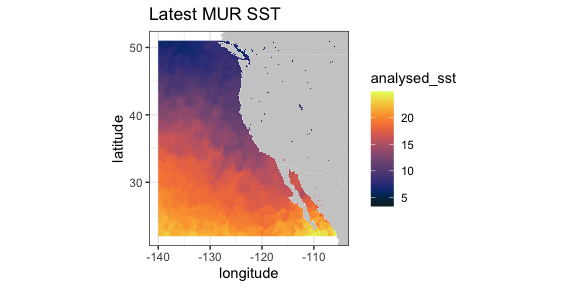

### VIIRS SST and Chlorophyll

VIIRS (Visible Infrared Imaging Radiometer Suite)  is a scanning radiometer, that collects visible and infrared imagery and radiometric measurements of the land, atmosphere, cryosphere, and oceans. VIIRS data is used to measure cloud and aerosol properties, ocean color, sea and land surface temperature, ice motion and temperature, fires, and Earth's albedo.   Both NASA and NOAA provide VIIRS-based high resolution SST and chlorophyll products.

ERD provides a 3-day composite SST product at 750 meter resolution developed from a real-time NOAA product. The most recent values can be obtained by setting "time" to be "last".  (Note that <span style="color:red">R</span> sees the latitude-longitude grid as slightly uneven (even though it is in fact even), and that produces artificial lines in `ggplot2::geom_raster()`.  In order to remove those lines, the latitude-longitude grid is remapped to an evenly-space grid.)

```{r VIIRS, echo = TRUE, eval = FALSE}
require("ggplot2")
require("mapdata")
require("rerddap")
sstInfo <- info('erdVHsstaWS3day')
# get latest 3-day composite sst
viirsSST <- griddap(sstInfo, latitude = c(41., 31.), longitude = c(-128., -115), time = c('last','last'), fields = 'sst')
# remap latitiudes and longitudes to even grid
myLats <- unique(viirsSST$data$latitude)
myLons <- unique(viirsSST$data$longitude)
myLats <- seq(range(myLats)[1], range(myLats)[2], length.out = length(myLats))
myLons <- seq(range(myLons)[1], range(myLons)[2], length.out = length(myLons))
# melt these out to full grid
mapFrame <- expand.grid(x = myLons, y = myLats)
mapFrame$y <- rev(mapFrame$y)
# form a frame with the new values and the data
tempFrame <- data.frame(sst = viirsSST$data$sst, lat = mapFrame$y, lon = mapFrame$x)
mycolor <- colors$temperature
w <- map_data("worldHires", ylim = c(30., 42.), xlim = c(-128, -114))
ggplot(data = tempFrame, aes(x = lon, y = lat, fill = sst)) +
    geom_polygon(data = w, aes(x = long, y = lat, group = group), fill = "grey80") +
    geom_raster(interpolate = FALSE) +
    scale_fill_gradientn(colours = mycolor, na.value = NA) +
    theme_bw() + ylab("latitude") + xlab("longitude") +
    coord_fixed(1.3, xlim = c(-128, -114),  ylim = c(30., 42.)) + ggtitle("Latest VIIRS 3-day SST")

```

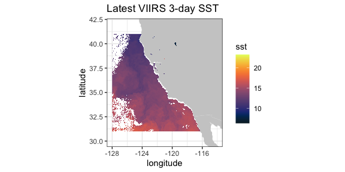


A time series from the same dataset at a given location,  here (36., -126.):

```{r, echo = TRUE, eval = FALSE}
require("ggplot2")
require("rerddap")
viirsSST1 <- griddap(sstInfo, latitude = c(36., 36.), 
                     longitude = c(-126., -126.), 
                     time = c('2015-01-01','2015-12-31'), fields = 'sst')
tempTime <- as.Date(viirsSST1$data$time, origin = '1970-01-01', tz = "GMT")
tempFrame <- data.frame(time = tempTime, sst = viirsSST1$data$sst)
```

```{r, echo = TRUE, eval = FALSE}
ggplot(tempFrame, aes(time, sst)) + 
  geom_line() + 
  theme_bw() + 
  ylab("sst") +
  ggtitle("VIIRS SST at (36N, 126W)")
```
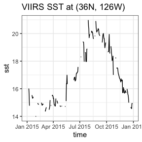


A similar 3-day composite for chloropyll for the same region from a scientific quality product developed by NOAA:

```{r VHNCHla, eval = FALSE, echo = TRUE}
require("ggplot2")
require("mapdata")
require("rerddap")
chlaInfo <- info('erdVHNchla3day')
viirsCHLA <- griddap(chlaInfo, latitude = c(41., 31.), 
                     longitude = c(-128., -115), time = c('last','last'), 
                     fields = 'chla')
```

```{r, eval = FALSE, echo = TRUE}
mycolor <- colors$chlorophyll
w <- map_data("worldHires", ylim = c(30., 42.), xlim = c(-128, -114))
ggplot(data = viirsCHLA$data, aes(x = longitude, y = latitude, fill = log(chla))) +
  geom_polygon(data = w, aes(x = long, y = lat, group = group), fill = "grey80") +
  geom_raster(interpolate = FALSE) +
  scale_fill_gradientn(colours = mycolor, na.value = NA) +
  theme_bw() + ylab("latitude") + xlab("longitude") +
  coord_fixed(1.3, xlim = c(-128, -114),  ylim = c(30., 42.)) + 
  ggtitle("Latest VIIRS 3-day Chla")
```

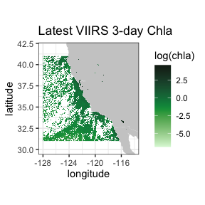


### Temperature at 70m in the north Pacific from the SODA model output

This is an example of an extract from a 4-D dataset (results from the "Simple Ocean Data Assimilation (SODA)" model - see https://www2.atmos.umd.edu/~ocean/), and illustrate the case where the z-coordinate does not have the default name "altitude".  Water temperature at 70m depth is extracted for the North Pacific Ocean.


```{r eval = FALSE, echo = TRUE}
require("rerddap")
dataInfo <- rerddap::info('hawaii_d90f_20ee_c4cb')
xpos <- c(135.25, 240.25)
ypos <- c(20.25, 60.25)
zpos <- c(70.02, 70.02)
tpos <- c('2010-12-15', '2010-12-15')
soda70 <- griddap(dataInfo,  longitude = xpos, latitude = ypos, 
                  time = tpos, depth = zpos, fields = 'temp' )

```

Since the data cross the dateline, it is necessary to use the new "world2Hires" continental outlines in the package `mapdata` which is Pacific Ocean centered.  Unfortunatley there is a small problem where the outlines from certain countries wrap and mistakenly appear in plots, and those countries must be removed,  see code below.


```{r soda70Plot, eval = FALSE, echo = TRUE}
require("ggplot2")
require("mapdata")
xlim <- c(135, 240)
ylim <- c(20, 60)
my.col <- colors$temperature
## Must do a kludge to remove countries that wrap and mess up the plot
w1 <- map("world2Hires", xlim = c(135, 240), ylim = c(20, 60), fill = TRUE, plot = FALSE)
remove <- c("UK:Great Britain", "France", "Spain", "Algeria", "Mali", "Burkina Faso", "Ghana", "Togo")
w <- map_data("world2Hires", regions = w1$names[!(w1$names %in% remove)], ylim = ylim, xlim = xlim)
myplot <- ggplot() +
    geom_raster(data = soda70$data, aes(x = longitude, y = latitude, fill = temp), interpolate = FALSE) +
    geom_polygon(data = w, aes(x = long, y = lat, group = group), fill = "grey80") +
    theme_bw() + scale_fill_gradientn(colours = my.col, na.value = NA, limits = c(-3,30), name = "temperature") +
    ylab("latitude") + xlab("longitude") +
    coord_fixed(1.3, xlim = xlim, ylim = ylim) +
    ggtitle(paste("70m temperature ", soda70$data$time[1]))
myplot
```

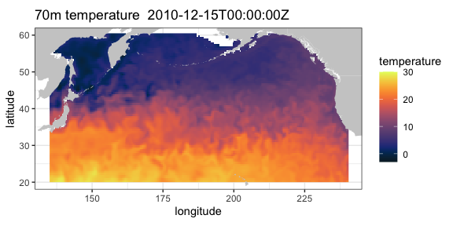

### Irish Marine Institute {#hourly}

The Irish Marine Institute has an <span style="color:red">ERDDAP™</span> server at https://erddap.marine.ie/erddap.  Among other datasets, they have hourly output from a model of the North Altantic ocean, with a variety of ocean related parameters, see the dataset *IMI_NEATL*.  To obtain the latest sea surface salinity for the domain of the model:

```{r NAtlSSS, eval = FALSE, echo = TRUE}
require("rerddap")
urlBase <- "https://erddap.marine.ie/erddap/"
parameter <- "sea_surface_salinity"
sssTimes <- c("last", "last")
sssLats <- c(48.00625, 57.50625)
sssLons <- c(-17.99375, -1.00625)
dataInfo <- rerddap::info("IMI_NEATL", url = urlBase)
NAtlSSS <- griddap(dataInfo, longitude = sssLons, latitude = sssLats, time = sssTimes, fields = parameter, url = urlBase)
```


and the extracted data plotted:

```{r NAtlSSSplot, eval = FALSE, echo = TRUE}
require("ggplot2")
require("mapdata")
xlim <- c(-17.99375, -1.00625)
ylim <- c(48.00625, 57.50625)
my.col <- colors$salinity
w <- map_data("worldHires", ylim = ylim, xlim = xlim)
myplot <- ggplot() +
    geom_raster(data = NAtlSSS$data, aes(x = longitude, y = latitude, fill = sea_surface_salinity), interpolate = FALSE) +
    geom_polygon(data = w, aes(x = long, y = lat, group = group), fill = "grey80") +
    theme_bw() + scale_fill_gradientn(colours = my.col, na.value = NA, limits = c(34, 36), name = "salinity") +
    ylab("latitude") + xlab("longitude") +
    coord_fixed(1.3, xlim = xlim, ylim = ylim) +
    ggtitle(paste("salinity", NAtlSSS$data$time[1]))
myplot
```

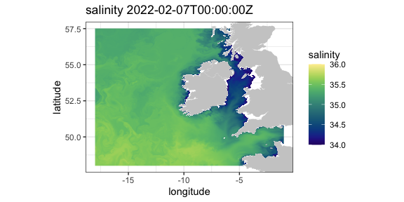

### IFREMER

The French agency IFREMER also has an <span style="color:red">ERDDAP™</span> server. Here salinity data at 75 meters from "Global Ocean, Coriolis Observation Re-Analysis CORA4.1" model off the west coast of the United States is extracted and plotted.

```{r IFREMER, eval = FALSE, echo = TRUE}
require("rerddap")
urlBase <- "https://www.ifremer.fr/erddap/"
parameter <- "PSAL"
ifrTimes <- c("2019-05-15", "2019-05-15")
ifrLats <- c(30., 50.)
ifrLons <- c(-140., -110.)
ifrDepth <- c(75., 75.)
dataInfo <- rerddap::info("CORIOLIS_GLOBAL_NRTOA_OBS_TIME_SERIE_PSAL", url = urlBase)
ifrPSAL <- griddap(dataInfo, longitude = ifrLons, latitude = ifrLats, time = ifrTimes, depth = ifrDepth,  fields = parameter, url = urlBase)
```

The `ggplot2` function `geom_raster()` is not designed for unevenly spaced coordinates, as are the latitudes from this model.  The function `interp()` from the package `akima` is used to interpolate the data which are then plotted.


```{r ifrPSALplot, eval = FALSE, echo = TRUE}
## ggplot2 has trouble with unequal y's
 require("akima")
 require("dplyr")
 require("ggplot2")
 require("mapdata")
  xlim <- c(-140, -110)
  ylim <- c(30, 51)
## ggplot2 has trouble with unequal y's
  my.col <- colors$salinity
  tempData1 <- ifrPSAL$data$PSAL
  tempData <- array(tempData1 , 61 * 54)
  tempFrame <- data.frame(x = ifrPSAL$data$longitude, y = ifrPSAL$data$latitude)
  tempFrame$temp <- tempData
  tempFrame1 <- dplyr::filter(tempFrame, !is.nan(temp))
  myinterp <- akima::interp(tempFrame1$x, tempFrame1$y, tempFrame1$temp, xo = seq(min(tempFrame1$x), max(tempFrame1$x), length = 61), yo = seq(min(tempFrame1$y), max(tempFrame1$y), length = 54))
  myinterp1 <- expand.grid(x = myinterp$x, y = myinterp$y)
  myinterp1$temp <- array(myinterp$z, 61 * 54)
  w <- map_data("worldHires", ylim = ylim, xlim = xlim)
 myplot <- ggplot() +
    geom_raster(data = myinterp1, aes(x = x, y = y, fill = temp), interpolate = FALSE) +
    geom_polygon(data = w, aes(x = long, y = lat, group = group), fill = "grey80") +
    theme_bw() + scale_fill_gradientn(colours = my.col, na.value = NA, limits = c(32, 35), name = "salinity") +
    ylab("latitude") + xlab("longitude") +
    coord_fixed(1.3, xlim = xlim, ylim = ylim) + ggtitle(paste("salinity at 75 meters",ifrPSAL$data$time[1] ))
 myplot
```

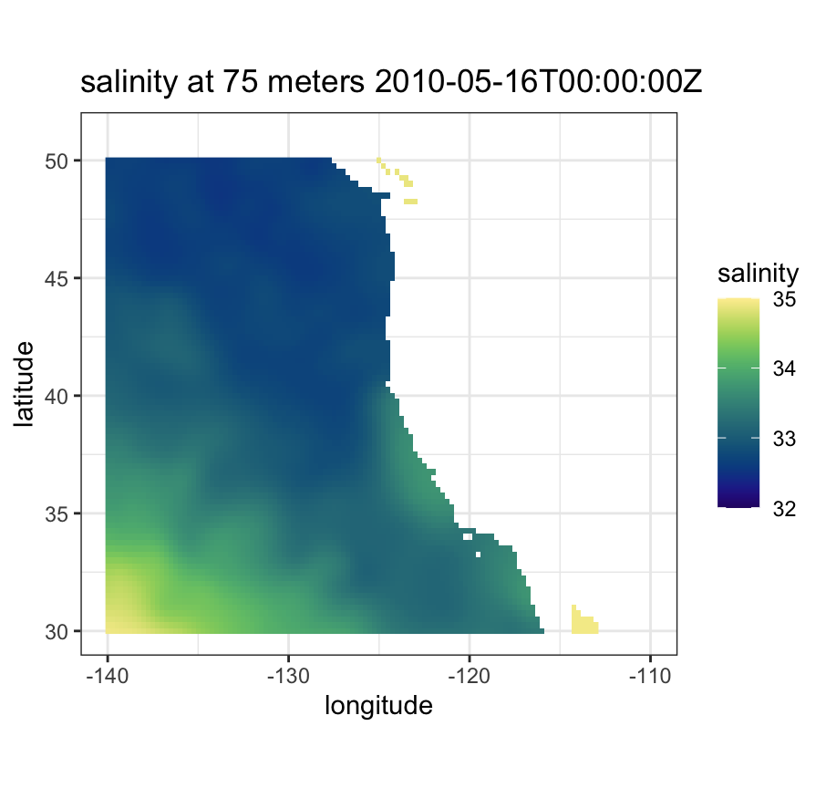

## tabledap


### CalCOFI data

CalCOFI (California Cooperative Oceanic Fisheries Investigations - https://calcofi.org) is a multi-agency partnership formed in 1949 to investigate the collapse of the sardine population off California. The organization's members are from NOAA Fisheries Service, Scripps Institution of Oceanography, and California Department of Fish and Wildlife. The scope of this research has evolved into the study of marine ecosystems off California and the management of its fisheries resources.  The nearly complete CalCOFI data, both physical and biological, are available through <span style="color:red">ERDDAP™</span>.

The following example is a modification of a script developed by Dr. Andrew Leising of the Southwest Fisheries Science Center.  The original script has been used to automate the generation of several yearly reports about the California Current Ecosystem.   The script gets chlorophyll data and a measure of primary productivity from the hydrocasts,and then calculates a seasoanlly adjusted chlorophyll anomaly as well as a seasonally adjusted primary productivity anomaly.  The first step is to get the information about the particular dataset:

```{r, eval = FALSE, echo = TRUE}
require("rerddap")
hydroInfo <- info('siocalcofiHydroCast')
```

and then get the desired data from 1984 through 2014:

```{r calCOFI, eval = FALSE, echo = TRUE}
require("rerddap")
calcofi.df <- tabledap(hydroInfo, fields = c('cst_cnt',  'date', 'year', 'month', 'julian_date', 'julian_day', 'rpt_line', 'rpt_sta', 'cruz_num', 'intchl', 'intc14', 'time'), 'time>=1984-01-01T00:00:00Z', 'time<=2014-04-17T05:35:00Z')
```


In versions of 'rerddap' before v1.1.0,  "intchl" and "intC14" are returned as character strings, and are easier to work with as numbers, so in earlier versions of you need to:

```{r calCOFInum, eval = FALSE, echo = TRUE}
if (packageVersion('rerddap') < '1.1.0'){
    calcofi.df$cruz_num <- as.numeric(calcofi.df$cruz_num)
    calcofi.df$intc14 <- as.numeric(calcofi.df$intc14)
    calcofi.df$time <- as.Date(calcofi.df$time, origin = '1970-01-01', tz = "GMT")
}
```


At this point the requested data are in the <span style="color:red">R</span> workspace - the rest of the code performs the calculations to derive the seasonally adjusted values and plot them.

```{r calCOFIPlot, eval = FALSE,  echo = TRUE}
require("dplyr")

# calculate cruise means
by_cruznum <- group_by(calcofi.df, cruz_num)
tempData <- select(by_cruznum, year, month, cruz_num, intchl, intc14)
CruiseMeans <- summarize(by_cruznum, cruisechl = mean(intchl, na.rm = TRUE), cruisepp = mean(intc14, na.rm = TRUE), year = median(year, na.rm = TRUE), month = median(month, na.rm = TRUE))
tempTimes <- paste0(CruiseMeans$year,'-',CruiseMeans$month,'-1')
cruisetimes <- as.Date(tempTimes, origin = '1970-01-01', tz = "GMT")
CruiseMeans$cruisetimes <- cruisetimes
# calculate monthly "climatologies"
byMonth <- group_by(CruiseMeans, month)
climate <- summarize(byMonth, ppClimate = mean(cruisepp, na.rm = TRUE), chlaClimate = mean(cruisechl, na.rm = TRUE))
# calculate anomalies
CruiseMeans$chlanom <- CruiseMeans$cruisechl - climate$chlaClimate[CruiseMeans$month]
CruiseMeans$ppanom <- CruiseMeans$cruisepp - climate$ppClimate[CruiseMeans$month]
# calculate mean yearly anomaly
byYear <- select(CruiseMeans, year)
tempData <- select(CruiseMeans, year, chlanom, ppanom )
byYear <- group_by(tempData, year)
yearlyAnom <- summarize(byYear, ppYrAnom = mean(ppanom, na.rm = TRUE), chlYrAnom = mean(chlanom, na.rm = TRUE))
yearlyAnom$year <- ISOdate(yearlyAnom$year, 01, 01, hour = 0)
ggplot(yearlyAnom, aes(year, chlYrAnom)) + geom_line() +
  theme_bw() + ggtitle('yearly chla anom')
ggplot(yearlyAnom, aes(year, ppYrAnom)) + geom_line() +
  theme_bw() + ggtitle('yearly pp anom')
```

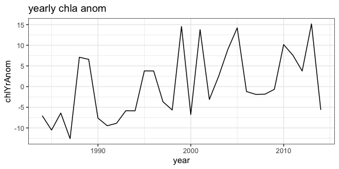
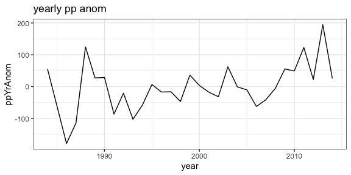

### Parquet files

A new feature in `tabledap()` is to choose to download the data as a parquet file rather than as a csv file - the parquet file can be up to 90% smaller in our tests  (note this will only work if the <span style="color:red">ERDDAP™</span> server is at least version 2.25,  otherwise the program will throw an error).  As any example, for the CalCOFI example above:

```{r parquet, eval = FALSE, echo = TRUE}
require("rerddap")
hydroInfo <- info('siocalcofiHydroCast')
calcofi.df <- tabledap(hydroInfo, fields = c('cst_cnt',  'date', 'year', 'month', 'julian_date', 'julian_day', 'rpt_line', 'rpt_sta', 'cruz_num', 'intchl', 'intc14', 'time'), 'time>=1984-01-01T00:00:00Z', 'time<=2014-04-17T05:35:00Z', fmt = 'parquet')
head(calcofi.df)
<ERDDAP tabledap> siocalcofiHydroCast
Path: [/var/folders/46/jyz1mm5x5bvbf59b5g8f7f580000gn/T//Rtmpo6E8y5/R/rerddap/50ff5f9fb5f56f480ff2f6ea034df8ef.parquet]
Last updated: [2024-12-10 11:04:01.948088]
File size:    [0.24 mb]
# A tibble: 6 × 12
cst_cnt date        year month julian_date julian_day rpt_line rpt_sta cruz_num intchl intc14
<int> <chr>      <int> <int>       <int>      <int>    <dbl>   <dbl> <chr>     <dbl>  <dbl>
  1   22523 01/05/1984  1984     1       30686          5       90      35 8401       30.3    NA 
2   22524 01/05/1984  1984     1       30686          5       90      30 8401       27.9    NA 
3   22525 01/05/1984  1984     1       30686          5       90      28 8401       29.9    NA 
4   22526 01/05/1984  1984     1       30686          5       90      32 8401       39.3   385.
5   22527 01/05/1984  1984     1       30686          5       90      37 8401       36.7    NA 
6   22528 01/06/1984  1984     1       30687          6       90      53 8401       30.3    NA 
# ℹ 1 more variable: time <dttm>

```


### CPS Trawl Surveys


The CPS (Coastal Pelagic Species) Trawl Life History Length Frequency Data contains the length distribution of a subset of individuals from a species (mainly non-target) caught during SWFSC-FRD fishery independent trawl surveys of coastal pelagic species. Measured lengths for indicated length type (fork, standard, total, or mantle) were grouped in 10 mm bins (identified by the midpoint of the length class) and counts are recorded by sex.

The number and location of sardines (Sardinops sagax) in the tows in March 2010 and 2011 are extracted, and compared with monthly SST from satellites.  First, query the <span style="color:red">ERDDAP™</span> server to see if CPS Trawl data are available through the <span style="color:red">ERDDAP™</span> server, and if so, obtain the datasetID for the dataset.

```{r CPS Query, eval = FALSE, echo = TRUE}
require("rerddap")
CPSquery <- ed_search(query = 'CPS Trawl')
CPSquery$alldata[[1]]$summary
CPSquery$alldata[[1]]$tabledap
CPSquery$alldata[[1]]$dataset_id
```

Then get the information for the CPS dataset:

```{r CPSINfo, eval = FALSE, echo = TRUE}
require("rerddap")
CPSinfo <- info('FRDCPSTrawlLHHaulCatch')
```

extract the desired CPS data:

```{r, eval = FALSE, echo = TRUE}
require("dplyr")
require("rerddap")
sardines <- tabledap(CPSinfo, fields = c('latitude',  'longitude', 'time', 'scientific_name', 'subsample_count'), 'time>=2010-01-01', 'time<=2012-01-01', 'scientific_name="Sardinops sagax"' )
if (packageVersion('rerddap') < '1.1.0'){
    sardines$time <- as.Date(sardines$time, origin = '1970-01-01', tz = "GMT")
    sardines$latitude <- as.numeric(sardines$latitude)
    sardines$longitude <- as.numeric(sardines$longitude)
}
sardines$time <- as.Date(sardines$time, origin = '1970-01-01', tz = "GMT")
sardines$latitude <- as.numeric(sardines$latitude)
sardines$longitude <- as.numeric(sardines$longitude)
sardine2010 <- filter(sardines, time < as.Date('2010-12-01'))
```

and plot the data versus monthly SST values:

```{r, eval = FALSE, echo = TRUE}
# get the dataset info
sstInfo <- info('erdMWsstdmday')
# get 201004 monthly sst
sst201004 <- griddap('erdMWsstdmday', latitude = c(22., 51.), longitude = c(220., 255), time = c('2010-04-16','2010-04-16'), fields = 'sst')
# get 201104 monthly sst
sst201104 <- griddap('erdMWsstdmday', latitude = c(22., 51.), longitude = c(220., 255), time = c('2011-04-16','2011-04-16'), fields = 'sst')
```

```{r CPSPlot, eval = FALSE, echo = TRUE}
# get polygons of coast for this area
w <- map_data("worldHires", ylim = c(22., 51.), xlim = c(220 - 360, 250 - 360))
# plot 201004 sst on the map
sardine2010 <- filter(sardines, time < as.Date('2010-12-01', origin = '1970-01-01', tz = "GMT"))
sardine2011 <- filter(sardines, time > as.Date('2010-12-01', origin = '1970-01-01', tz = "GMT"))
mycolor <- colors$temperature
p1 <- ggplot() +
  geom_polygon(data = w, aes(x = long, y = lat, group = group), fill = "grey80") +
  geom_raster(data = sst201004$data, aes(x = (longitude - 360), y = latitude, fill = sst), interpolate = FALSE) +
  scale_fill_gradientn(colours = mycolor, na.value = NA, limits = c(5,30)) +
  theme_bw() + ylab("latitude") + xlab("longitude") +
  coord_fixed(1.3, xlim = c(220 - 360, 250 - 360),  ylim = c(22., 51.))

# plot 201104 sst on the map
p2 <- ggplot() +
  geom_polygon(data = w, aes(x = long, y = lat, group = group), fill = "grey80") +
  geom_raster(data = sst201104$data, aes(x = (longitude - 360), y = latitude, fill = sst), interpolate = FALSE) +
  geom_point(data = sardine2011, aes(x = longitude, y = latitude, colour = subsample_count)) +
  scale_fill_gradientn(colours = mycolor, na.value = NA, limits = c(5,30)) +
  theme_bw() + ylab("latitude") + xlab("longitude") +
  coord_fixed(1.3, xlim = c(220 - 360, 250 - 360),  ylim = c(22., 51.))
p1 + geom_point(data = sardine2010, aes(x = longitude, y = latitude, colour = subsample_count)) + scale_colour_gradient(space = "Lab", na.value = NA, limits = c(0,80))

p2 +   geom_point(data = sardine2011, aes(x = longitude, y = latitude, colour = subsample_count)) + scale_colour_gradient(space = "Lab", na.value = NA, limits = c(0,80))
```

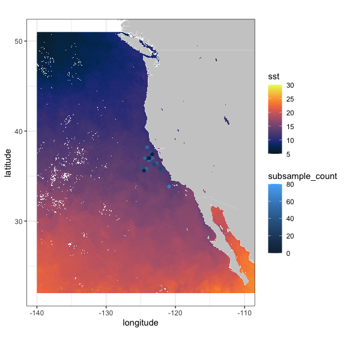
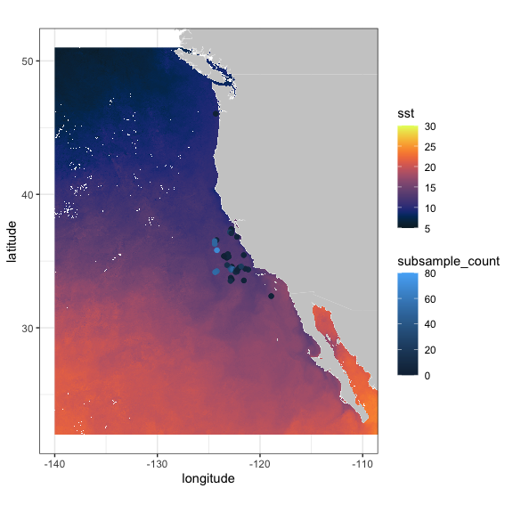

Also of interest is the distribution of sardines through the years:

```{r, eval = FALSE,  echo = TRUE}
sardinops <- tabledap(CPSinfo, fields = c('longitude', 'latitude', 'time'),  'scientific_name="Sardinops sagax"')
if (packageVersion('rerddap') < '1.1.0') {
    sardinops$time <- as.Date(sardinops$time, origin = '1970-01-01', tz = "GMT")
    sardinops$year <- as.factor(format(sardinops$time, '%Y'))
    sardinops$latitude <- as.numeric(sardinops$latitude)
    sardinops$longitude <- as.numeric(sardinops$longitude)
}
sardinops$year <- as.factor(format(sardinops$time, '%Y'))

```

```{r sardinesPlot, eval = FALSE, echo = TRUE}
xlim <- c(-135, -110)
ylim <- c(30, 51)
coast <- map_data("worldHires", ylim = ylim, xlim = xlim)
ggplot() +
    geom_point(data = sardinops, aes(x = longitude, y = latitude, colour = year)) +
    geom_polygon(data = coast, aes(x = long, y = lat, group = group), fill = "grey80") +
    theme_bw() + ylab("latitude") + xlab("longitude") +
    coord_fixed(1.3, xlim = xlim, ylim = ylim) +
    ggtitle("Location of sardines by year in EPM Trawls")
```

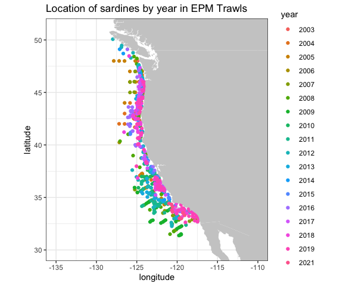


### NDBC Buoys

NOAA's National Data Buoy Center (NDBC) collects world-wide data from buoys in the ocean. <span style="color:red">ERDDAP™</span> can be searched for the location of all buoys in a bounding box with latitudes(37N, 47N) and longitudes (124W, 121W) and the results plotted:

```{r, eval = FALSE, echo = TRUE}
# get location and station ID of NDBC buoys in a region
BuoysInfo <- info('cwwcNDBCMet')
locationBuoys <- tabledap(BuoysInfo, distinct = TRUE, fields = c("station", "longitude", "latitude"), "longitude>=-124", "longitude<=-121", "latitude>=37", "latitude<=47")
if (packageVersion('rerddap') < '1.1.0') {
   locationBuoys$latitude <- as.numeric(locationBuoys$latitude)
   locationBuoys$longitude <- as.numeric(locationBuoys$longitude)
}
```

```{r NDBC, eval = FALSE,  echo = TRUE}
xlim <- c(-130, -110)
ylim <- c(35, 50)
coast <- map_data("worldHires", ylim = ylim, xlim = xlim)
ggplot() +
   geom_point(data = locationBuoys, aes(x = longitude , y = latitude, colour = factor(station) )) +
   geom_polygon(data = coast, aes(x = long, y = lat, group = group), fill = "grey80") +
   theme_bw() + ylab("latitude") + xlab("longitude") +
   coord_fixed(1.3, xlim = xlim, ylim = ylim) +
   ggtitle("Location of buoys in given region")

```

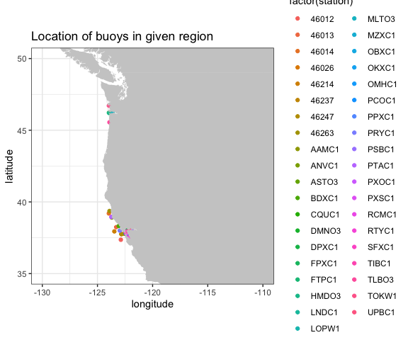

Looking at wind speed for 2012 for station "46012"

```{r, eval = FALSE, echo = TRUE}
buoyData <- tabledap(BuoysInfo, fields = c("time", "wspd"), 'station="46012"', 'time>=2012-01-01', 'time<=2013-01-01')
if (packageVersion('rerddap') < '1.1.0') {
    buoyData$wspd <- as.numeric(buoyData$wspd)
    buoyData$time <- as.Date(buoyData$time, origin = '1970-01-01', tz = "GMT")
}
```

```{r NDBCTS, eval = FALSE, echo = TRUE}
ggplot(buoyData, aes(time, wspd)) + 
  geom_line() + 
  theme_bw() + 
  ylab("wind speed") +
  ggtitle("Wind Speed in 2012 from buoy 46012 ")
```
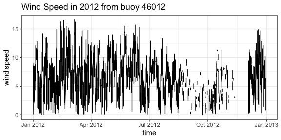

###  IOOS Glider Data

The mission of the IOOS Glider DAC is to provide glider operators with a simple process for submitting glider data sets to a centralized location, enabling the data to be visualized, analyzed, widely distributed via existing web services and the Global Telecommunications System (GTS) and archived at the National Centers for Environmental Information (NCEI).
The IOOS Glider Dac is accessible through `rerddap` (https://gliders.ioos.us/erddap/index.html).  Extracting and plotting salinity from part of the path of one glider deployed by the Scripps Institution of Oceanography:

```{r, eval = FALSE, echo = TRUE}
urlBase <- "https://data.ioos.us/gliders/erddap/"
gliderInfo <- info("sp064-20161214T1913",  url = urlBase)
glider <- tabledap(gliderInfo, fields = c("longitude", "latitude", "depth", "salinity"), 'time>=2016-12-14', 'time<=2016-12-23', url = urlBase)
if (packageVersion('rerddap') < '1.1.0') {
    glider$longitude <- as.numeric(glider$longitude)
    glider$latitude <- as.numeric(glider$latitude)
    glider$depth <- as.numeric(glider$depth)
}
```

```{r glider, eval = FALSE, echo = TRUE}
require("plot3D")
scatter3D(x = glider$longitude , y = glider$latitude , z = -glider$depth, colvar = glider$salinity,              col = colors$salinity, phi = 40, theta = 25, bty = "g", type = "p",
           ticktype = "detailed", pch = 10, clim = c(33.2,34.31), clab = 'Salinity',
           xlab = "longitude", ylab = "latitude", zlab = "depth",
           cex = c(0.5, 1, 1.5))
```

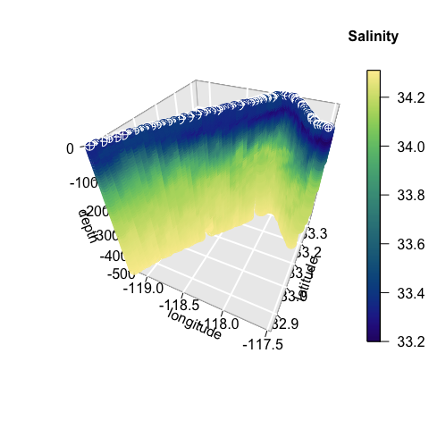

## Animal Telemetry Network (ATN)

The Integrated Ocean Observing System Animal Telemetry Network (IOOS ATN) is designed to serve as an access point to search, discover and access animal telemetry data, and associated oceanographic datasets, from a wide variety of species and platforms.  The track of one of the tagged animals is extracted, and plotted with SST value from satellite along the track.


```{r, echo = TRUE, eval = FALSE}
atnURL <- 'https://oceanview.pfeg.noaa.gov/erddap/'
atnInfo <- info('gtoppAT', url = atnURL)
atnData <- tabledap(atnInfo, fields = c("time", "longitude", "latitude"), 'toppID="1807001"', url = atnURL)
atnData$latitude <- as.numeric(atnData$latitude)
atnData$longitude <- as.numeric(atnData$longitude)
ncdcSST = array(NA_real_, dim = length(atnData$time))
ncdcSSTInfo = info('ncdcOisst2Agg')
time_bound <- c(as.character(atnData$time[i]), as.character(atnData$time[i]))
for (i in 1:length(atnData$time)) {
  extract <- griddap(ncdcSSTInfo, 
                     fields = 'sst', 
                     latitude = c(atnData$latitude[i], atnData$latitude[i]), 
                     longitude = c(atnData$longitude[i], atnData$longitude[i]), 
                     time = time_bound
                     )
ncdcSST[i] <- extract$data$sst
}
```

```{r, eval = FALSE,  echo = TRUE}
ylim <- c(32.5, 34)
xlim <- c(-119, -116.5)
mycolor <- colors$temperature
w <- map_data("worldHires", ylim = ylim, xlim = xlim)
alldata <- data.frame(sst = ncdcSST, longitude = atnData$longitude - 360, latitude = atnData$latitude)
z <- ggplot(alldata, aes(x = longitude, y = latitude)) +
   geom_point(aes(colour = sst), size = .5)
z + geom_polygon(data = w, aes(x = long, y = lat, group = group), fill = "grey80") +
  theme_bw() +
  scale_colour_gradientn(colours = mycolor, limits = c(16.9, 17.3), "SST") +
  coord_fixed(1.3, xlim = xlim, ylim = ylim) + ggtitle("SST Along Track")

```

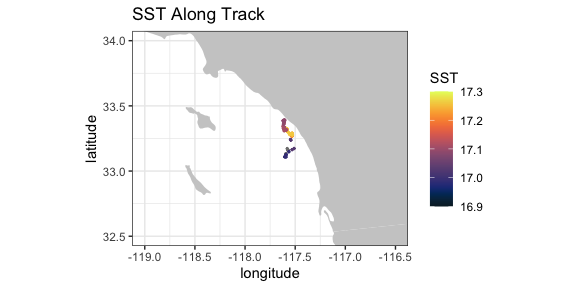

## California Current System Integrated Ecosystem Assessment (CCSIEA)

The primary goals of the CCIEA are to better understand the web of interactions that drive patterns and trends of components within the California Current ecosystem, and forecast how changing environmental conditions and management actions affect the status of these components. The conceptual model of the social-ecological system of the California Current illustrates how humans and their social systems are inextricably linked to these marine, coastal, and upland environments (see \code("www.integratedecosystemassessment.noaa.gov/regions/california-current/projects").

The over 300 indices developed for the CCSIEA are available through `rerddap`.  Here an index of coho abundance in California is compared with the February value of an index of the strength and location of the North Pacific High, developed in "The North Pacific High and wintertime pre-conditioning of California current productivity" by Schroeder et al.  (Geophys. Res. Lett., 40, 541–546).

```{r, eval = FALSE, echo = TRUE}
urlBase <- 'https://coastwatch.pfeg.noaa.gov/erddap/'
nphInfo <- info('erdNph', url = urlBase)
nphData <- tabledap(nphInfo, fields = c("year", "maxSLP" ), 'month=2', 'year>=1987', url = urlBase)
nphData$maxSLP <- as.numeric(nphData$maxSLP)
urlBase <- 'https://oceanview.pfeg.noaa.gov/erddap/'
cohoInfo <- info('cciea_SM_CA_CO_ABND', url = urlBase)
cohoData <- tabledap(cohoInfo, fields = c("abundance_anomaly", "time"),  url = urlBase)
if (packageVersion('rerddap') < '1.1.0') {
    cohoData$abundance_anomaly <- as.numeric(cohoData$abundance_anomaly)
}
alldata <- data.frame(coho = cohoData$abundance_anomaly[1:27], maxSLP = nphData$maxSLP, year = nphData$year)
```

```{r, eval = FALSE, echo = TRUE}
ggplot(alldata) + geom_line(aes(x = year, y = coho), colour = 'blue') + theme_bw() + ggtitle("coho abundance anomaly")
ggplot(alldata) + geom_line(aes(x = year, y = maxSLP), colour = 'red') + theme_bw() + ggtitle("MaxSLP")
```

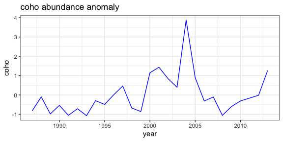
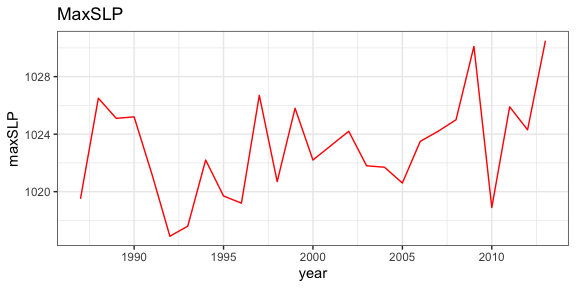

## Cacheing, "last", "now", idempotency, and a gotcha

`rerddap` by default caches the requests you make, so that if you happen to make the same request again, the data is restored from the cache, rather than having to go out and retrieve it remotely.  For most applications, this a boon (such as when "knitting" and "reknitting" this document), as it can speed things up when doing a lot of request in a script, and works because in most cases an <span style="color:red">ERDDAP™</span> request is "idempotent".  This means that the the request will always return the same thing no matter what requests came before - it doesn't depend on state. However this is not true if the script uses either "last" in `griddap()` or "now" in `tabledap()` as these will return different values as time elapses and data are added to the datasets.  While it is desirable to have <span style="color:red">ERDDAP™</span> purely idempotent,  the "last" and "now" constructs are very helpful for people using <span style="color:red">ERDDAP™</span> in dashboards, webpages, regular input to models and the like, and the benefits far outweigh the problems.  However, if you are using either "last" or "now" in an `rerddap` based script, you want to be very careful to clear the `rerddap` cache, otherwise the request will be viewed as the same,  and the data from the last request, rather than the latest data, will be returned.  Note that several examples in this vignette use "last", and therefore the graphics may look different depending on when you "knitted" the vignette.

For help in dealing with the cache, see:

```{r,  eval = FALSE, echo = TRUE}
?cache_delete
?cache_delete_all
?cache_details
?cache_list
```


## Reading data from a netCDF file. {#ncdf4}

Here we give a brief summary of how to read in part of the data from a netCDF file.  The basic steps are:

* Open the netCDF file
* Map coordinate values to array indices
* Extract the data

A sample netCDF file, "MWsstd1day.nc" is included.  This is a small file and is a toy example,  but the basic principles remain the same for a larger file.

Open the netCDF file:

```{r}
require("ncdf4")
exampleFile <- system.file("extdata", "MWsstd1day.nc", package = "rerddap")
sstFile <- nc_open(exampleFile)
```

While it is possible to obtain the coordinate values by extracting them from the file,  `ncdf4` by default does so automatically in `nc_open`. The names of the coordinate dimensions can be found from:

```{r}
names(sstFile$dim)
```

(note that the coordinate names here are given in 'C' order,  while for an extract the coordinates will be in the opposite, "Fortran" order) and the values of any coordinate, say longitude, can be found from:

```{r}
sstFile$dim$longitude$vals
```

The names of the variables in the netCDF file can be found from:

```{r}
names(sstFile$var)
```


An extract is done by giving the pointer to the netCDF file ("sstFile" in this instance), the name of the variable ot be extracted ("sst" in this instance), the  starting index value (in array coordinates) for each dimension, and the the count (the number of other index values) to include.  If all values of a particular dimension are wanted, then "-1" can be used for the count.  So for example to extract all of the values for the first day:

```{r}
require("ncdf4")
day1SST <- ncvar_get(sstFile, "sst", start = c(1, 1, 1, 1), count = c(1, 1, -1, -1))
```

Suppose we only want the latitudes from (30.0, 30.5) and longitudes (210.0, 210.5) for the first day.  We need to find the array indices that match those coordinate values:

```{r}
latMin <- which(sstFile$dim$latitude$vals == 30.0)
latMax <- which(sstFile$dim$latitude$vals == 30.5)
lonMin <- which(sstFile$dim$longitude$vals == 210.0)
lonMax <- which(sstFile$dim$longitude$vals == 210.5)
```

and then extract the data:

```{r}
require("ncdf4")
day1SST <- ncvar_get(sstFile, "sst", start = c(lonMin, latMin, 1, 1), count = c( (lonMax - lonMin + 1), (latMax - latMin + 1), 1, 1 ))
```


If we wanted a time series at (30N, 210E) it would be:

```{r}
require("ncdf4")
day1SST <- ncvar_get(sstFile, "sst", start = c(lonMax, latMin, 1, 1), count = c(1, 1, 1, -1 ))
```

For this example, it is easy to visually peruse the dimension values but for a large extract this might not be the possible.  Suppose we wanted all values in a latitude range or (30.1, 30.3) and since the range of values we are interested in might not be on a grid boundary we want the smallest range that would include these values  (that is if not on the grid then the smallest value may be less than 30.1)  and similarly for longitude, say (210.1, 210.3):

```{r}
latMin <- max(which(sstFile$dim$latitude$vals <= 30.1))
latMax <- min(which(sstFile$dim$latitude$vals >= 30.3))
lonMin <- max(which(sstFile$dim$longitude$vals <= 210.1))
lonMax <- min(which(sstFile$dim$longitude$vals >= 210.3))

```

and then perform the extract as before:

```{r}
require("ncdf4")
day1SST <- ncvar_get(sstFile, "sst", start = c(lonMin, latMin, 1, 1), count = c( (lonMax - lonMin + 1), (latMax - latMin + 1), 1, 1 ))
```
