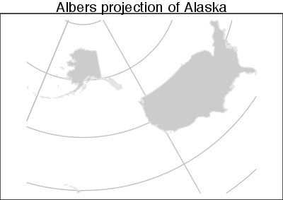

```{r setup, include=FALSE}
knitr::opts_chunk$set(
  message = FALSE,
  comment = "#>",
  collapse = TRUE,
  fig.width = 3.45,
  fig.asp = 1,
  fig.show = "hold",
  cache = TRUE
)
```

## Getting started with `plotdap()`

The `plotdap()` function makes it easy to visualize data acquired via `tabledap()` or `griddap()`. Regardless of the data you want to visualize, you'll always want to start a plot via `plotdap()`, where you may specify some "global" plotting options. Subsequent sections will demonstrate how to add tables/grids via `add_tabledap()`/`add_griddap()`, but for now we'll focus on options provided by `plotdap()`. Most importantly, the first argument decides whether [base](https://stat.ethz.ch/R-manual/R-devel/library/graphics/html/plot.html) or [ggplot2](https://cran.r-project.org/package=ggplot2) graphics should be used for the actual plotting.

```{r}
library(rerddap)
plotdap()
plotdap("base")
```

In addition to choosing a plotting method, `plotdap()` is where you can define properties of the background map, including the target projection using a valid coordinate reference system (CRS) defintion. Projection is performed using the [PROJ.4 library](http://proj4.org/), and [spatialreference.org](http://www.spatialreference.org) is a great resource for finding PROJ.4 CRS descriptions. Using the search utility, you can for example, [search for "South Pole"](http://spatialreference.org/ref/sr-org/?search=South+Pole&srtext=Search) and pick from a number of options. Here I've chosen the [MODIS South Pole Stereographic](http://spatialreference.org/ref/sr-org/8375/) option and copy-pasted the [Proj4 page](http://spatialreference.org/ref/sr-org/8375/proj4/) with the CRS definition: 

```{r, fig.width=7}
plotdap("base",
  mapTitle = "MODIS South Pole Stereographic", 
  mapFill = "transparent", 
  mapColor = "steelblue",
  crs = "+proj=stere +lat_0=-90 +lat_ts=-90 +lon_0=-63 +k=1 +x_0=0 +y_0=0 +ellps=WGS84 +datum=WGS84 +units=m +no_defs"
)
```

You might notice that some projections aren't "well-defined" on a global scale, and thus, may result in an error, or a "broken" looking map. For instance, [this Albers projection centered on Alaska](http://spatialreference.org/ref/epsg/3467/):

```{r, eval = FALSE}
alaska <- "+proj=aea +lat_1=55 +lat_2=65 +lat_0=50 +lon_0=-154 +x_0=0 +y_0=0 +ellps=GRS80 +towgs84=0,0,0,0,0,0,0 +units=m +no_defs"
plotdap("base", crs = alaska)
```

```r
#> Error code: 6
#> Error in CPL_transform(x, crs$proj4string, crs$epsg) : OGR error
```

That does not mean we can't use this (or similar) projections -- we just have to be careful that they are sensible given the lat/lon limits. By default, those limits span the entire world, but as we'll see later, the limits are shrunk to the given data (`griddap()`/`tabledap()`) limits. In other words, we should expect this projection to work once we "add" some data located near Alaska to the visualization. However, in case you want to make a map without any data, or want to customize the background map in some special way, you can supply an [**sf**](https://CRAN.R-project.org/package=sf) object (or something coercable to an **sf** object) to the `mapData` argument.

```{r}
library(sf)
library(mapdata)
w <- st_as_sf(maps::map("world", plot = FALSE, fill = TRUE))
us <- st_transform(filter(w, ID == "USA"), alaska)
plotdap(mapData = us)
```

With the odd exception of projections, the options available in `plotdap()` should *just work* for either plotting method. More advanced users that know some base/ggplot2 plotting may want more control of certain aspects of the plot. A later section (Customizing `plotdap()` objects) covers this topic.


## Adding `tabledap()` layers

## Adding `griddap()` layers

## Combining tables/grids

Touch on pipes?

## Customizing `plotdap()` objects

By this point, you might have noticed some subtle differences in the defaults of `plotdap("ggplot2")` versus `plotdap("base")`. The default base version is left intentially minimal as it is often much harder (or impossible) to remove elements from a base graphic once it's drawn. 


```{r}
library(ggplot2)
plotdap(mapTitle = "Map of the world") %>%
  add_ggplot(
    labs(
      subtitle = "Bow to your leader",
      caption = "citation needed"
    ), 
    ggthemes::theme_map()
  )
```


## Troubleshooting

* Cairo device

```{r}
library(Cairo)
Cairo("myPlot.png")
us
dev.off()
```

```{r, echo=FALSE}

```


<!--
## Basic interactive map  

```{r cars}
library(rerddap)
library(leaflet)

tab <- tabledap('erdCinpKfmBT')
# this info() function has useful meta-information about the data
# TODO: make this info() function a generic function?
info(attr(tab, "datasetid"))


tab[] <- lapply(tab, as.numeric)

leaflet() %>%
  addTiles() %>%
  addMarkers(data = tab, clusterOptions = markerClusterOptions())
```
-->
